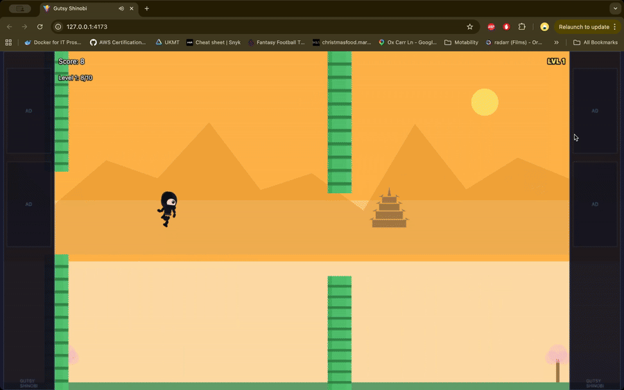

# Gutsy Shinobi

Local browser game inspired by Flappy Bird: guide the shinobi through bamboo gates, survive hazards, and set local high scores.

## Gameplay Preview

<p align="center">
  
  <br />
  <sub>Leaderboard and score flow</sub>
</p>

## What this repo contains

- `frontend/`: Vite + Phaser browser game (the app)
- `docs/`: setup, user, deployment, and architecture notes
- `frontend/public/audio/`: required game audio assets retained intentionally

## Play locally (desktop)

### 1) Install prerequisites

- Node.js 20+
- npm 10+

### 2) Run the game

```bash
cd frontend
npm install
npm run dev
```

Open the local URL printed by Vite (usually `http://localhost:5173`).

### 3) Build a production bundle (optional)

```bash
cd frontend
npm run build
npm run preview
```

## How to play

- `Space` or tap/click: jump
- `Enter`: confirm/restart and deflect when deflect window is open
- `L`: open/close leaderboard
- `Esc`: close leaderboard

Goal: survive hazards and pass barriers to increase your score.

## Testing

```bash
cd frontend
npm run test:run
```

Note: there is currently one known failing assertion in `frontend/src/game/persistence/leaderboardStore.test.js` that should be fixed before tagging a release.

## Security and privacy

- No backend service is included in this repository.
- Leaderboard data is local-only (`localStorage`) and never sent to a server.
- No API keys, tokens, or credentials are stored in tracked files.
- See `SECURITY.md` for reporting guidance.

## Documentation index

- Install guide: `docs/install-guide.md`
- User guide: `docs/user-guide.md`
- Deployment guide: `docs/deployment-guide.md`
- Release checklist: `docs/release-checklist.md`
- Architecture notes: `docs/architecture-notes.md`
- Archived assets/code notes: `docs/archive/README.md`
